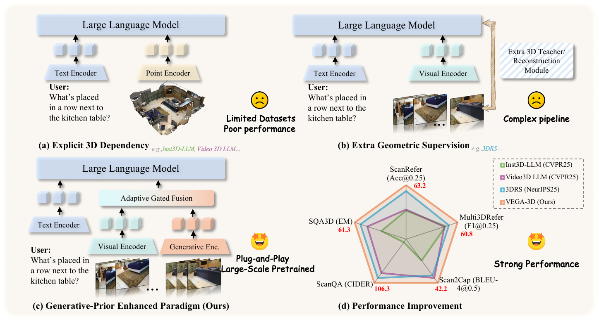
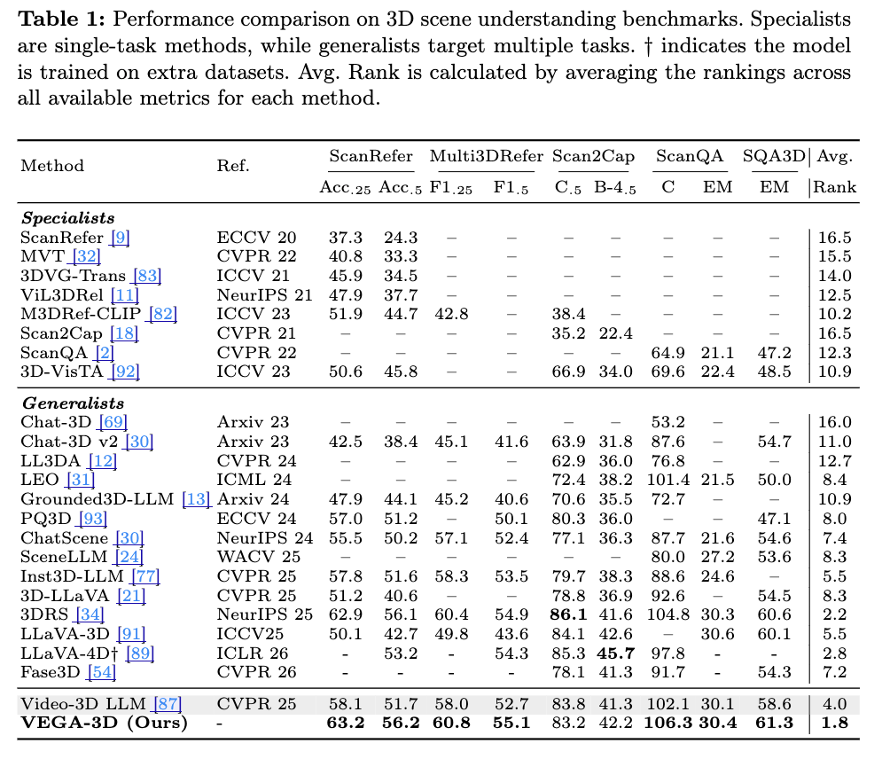

# Generation Models Know Space: Unleashing Implicit 3D Priors for Scene Understanding

<div align="center">
  <a href="https://arxiv.org/"></a>
  <a href="https://h-embodvis.github.io"></a>
  <a href="https://huggingface.co/zd11024/Video3D-LLM-LLaVA-Qwen-Uniform-32" target="_blank"></a>
  <a href="https://opensource.org/licenses/Apache-2.0"></a>

  <h5 align="center"><em><a href="https://github.com/HyperbolicCurve">Xianjin Wu</a><sup>1</sup>, <a href="https://dk-liang.github.io/">Dingkang Liang</a><sup>1</sup>, <a href="https://jerryfeng2003.github.io/">Tianrui Feng</a><sup>1</sup>, Kui Xia<sup>2</sup>, Yumeng Zhang<sup>2</sup>, Xiaofan Li<sup>2</sup>, Xiao Tan<sup>2</sup>, <a href="https://scholar.google.com/citations?user=UeltiQ4AAAAJ&hl=en">Xiang Bai</a><sup>1</sup><sup>*</sup></em></h5>
  <sup>1</sup> Huazhong University of Science and Technology, <sup>2</sup> Baidu Inc., China
</div>

This repository contains the official implementation of **VEGA-3D** for the paper **Generation Models Know Space: Unleashing Implicit 3D Priors for Scene Understanding**.

## 📄 Abstract

While Multimodal Large Language Models demonstrate strong semantic capabilities, they often suffer from spatial blindness and struggle with fine-grained geometric reasoning and physical dynamics. Existing solutions usually depend on explicit 3D modalities or heavy geometric scaffolding, which are costly to scale and often limited by data availability and generalization.

This work explores a different direction: instead of adding explicit 3D supervision, we leverage the implicit spatial prior learned inside large-scale video generation models. We introduce **VEGA-3D** (**V**ideo **E**xtracted **G**enerative **A**wareness), a plug-and-play framework that repurposes a pre-trained video diffusion model as a latent world simulator. By extracting spatiotemporal features from intermediate noise levels and fusing them with semantic representations through token-level adaptive gated fusion, VEGA-3D enriches MLLMs with dense geometric cues for 3D scene understanding, spatial reasoning, and embodied decision making.

## 🔍 Overview

<div align="center">
  <a href="assets/intro.png">
    
  </a>
</div>

## 📣 News

- `2026.03.20`: Released the paper, training and evaluation code.

## 📈 Performance

<div align="center">
  <a href="assets/performance.png">
    
  </a>
</div>

## ⚙️ Installation

1. Clone this repository and navigate to the VEGA-3D:

```bash
git clone https://github.com/H-EmbodVis/VEGA-3D.git
cd VEGA-3D
```
2. Create the conda environment:

```bash
conda create -n vega3d python=3.10 -y
conda activate vega3d
pip install --upgrade pip
pip install -e ".[train]"
pip install flash-attn --no-build-isolation     # install flash attention
```

## Dataset/Model Preparation

### 1. Dataset preparation

Please download the required datasets from the sources below and organize them following the same directory structure as [Video-3D-LLM](https://huggingface.co/datasets/zd11024/Video-3D-LLM_data). The repository expects a `data/` root following structure:

```text
data/
├── benchmark/
├── embodiedscan/
├── mask/
├── metadata/
├── models/
├── processed/
└── scannet/
```

### 2. Model preparation

All checkpoints should be placed under `data/models/` and named exactly as expected by the training scripts.

Required checkpoints for all released settings:

| Model | Hugging Face | Expected local path | Used by |
| --- | --- | --- | --- |
| LLaVA-Video-7B-Qwen2 | [lmms-lab/LLaVA-Video-7B-Qwen2](https://huggingface.co/lmms-lab/LLaVA-Video-7B-Qwen2) | `data/models/LLaVA-Video-7B-Qwen2` | All training scripts |
| SigLIP | [google/siglip-so400m-patch14-384](https://huggingface.co/google/siglip-so400m-patch14-384) | `data/models/siglip-so400m-patch14-384` | All training scripts |

Download them first:

```bash
mkdir -p data/models

huggingface-cli download lmms-lab/LLaVA-Video-7B-Qwen2 \
  --local-dir data/models/LLaVA-Video-7B-Qwen2

huggingface-cli download google/siglip-so400m-patch14-384 \
  --local-dir data/models/siglip-so400m-patch14-384
```

Optional generative backbones and auxiliary checkpoints. Download only the ones required by the script you plan to run:

| Model | Hugging Face | Expected local path | Used by |
| --- | --- | --- | --- |
| Wan2.1-T2V-1.3B | [Wan-AI/Wan2.1-T2V-1.3B](https://huggingface.co/Wan-AI/Wan2.1-T2V-1.3B) | `data/models/Wan2.1-T2V-1.3B` | `scripts/3d/train/train_wan_t2v_online.sh` |
| Wan2.1-VACE-1.3B | [Wan-AI/Wan2.1-VACE-1.3B](https://huggingface.co/Wan-AI/Wan2.1-VACE-1.3B) | `data/models/Wan2.1-VACE-1.3B` | `scripts/3d/train/train_wan_vace_online.sh` |
| Stable Diffusion 2.1 | [Manojb/stable-diffusion-2-1-base](https://huggingface.co/Manojb/stable-diffusion-2-1-base) | `data/models/stable-diffusion-2-1-base` | `scripts/3d/train/train_sd21_online.sh`, `scripts/3d/train/train_vae_online.sh`, and SEVA/Vmem preprocessing |
| Stable Video Diffusion | [stabilityai/stable-video-diffusion-img2vid](https://huggingface.co/stabilityai/stable-video-diffusion-img2vid) | `data/models/stable-video-diffusion-img2vid` | `scripts/3d/train/train_svd_online.sh` |
| DINOv3 Large | [timm/vit_large_patch16_dinov3.lvd1689m](https://huggingface.co/timm/vit_large_patch16_dinov3.lvd1689m) | `data/models/vit_large_patch16_dinov3.sat493m` | `scripts/3d/train/train_dinov3_online.sh` |
| V-JEPA V2 | [facebook/vjepa2-vitg-fpc64-384-ssv2](https://huggingface.co/facebook/vjepa2-vitg-fpc64-384-ssv2) | `data/models/vjepa2-vitg-fpc64-384-ssv2` | `scripts/3d/train/train_vjepa_online.sh` |
| VGGT | [facebook/VGGT-1B](https://huggingface.co/facebook/VGGT-1B) | `data/models/VGGT-1B` | `scripts/3d/train/train_vggt_online.sh` |
| SEVA | [stabilityai/stable-virtual-camera](https://huggingface.co/stabilityai/stable-virtual-camera) | `data/models/stable-virtual-camera` | `scripts/3d/train/train_seva_offline.sh` |
| Vmem | [liguang0115/vmem](https://huggingface.co/liguang0115/vmem) | `data/models/vmem` | `scripts/3d/train/train_vmem_offline.sh` |

Additional CLIP checkpoint for models that require a separate text/conditioning encoder:

| Model | Hugging Face | Expected local path | Required by |
| --- | --- | --- | --- |
| CLIP-ViT-H-14-laion2B-s32B-b79K | [laion/CLIP-ViT-H-14-laion2B-s32B-b79K](https://huggingface.co/laion/CLIP-ViT-H-14-laion2B-s32B-b79K) | `data/models/CLIP-ViT-H-14-laion2B-s32B-b79K` | `scripts/3d/train/train_svd_online.sh` and SEVA/Vmem preprocessing |

Notes:

- See [detailed checkpoint setup](llava/model/multimodal_generative_encoder/MODEL_PREPARATION.md) for auxiliary files such as `empty_prompt_embeds.pt`, WAN prompt embeddings, VGGT checkpoint placement, and SEVA/Vmem preprocessing dependencies.


## 🏋 Training/Evaluation

This README keeps only the three main script examples used to present the released VEGA-3D settings.

### 1. VEGA-3D with WAN-T2V

```bash
bash scripts/3d/train/train_wan_t2v_online.sh
```

### 2. VEGA-3D with WAN-VACE

```bash
bash scripts/3d/train/train_wan_vace_online.sh
```

### 3. VEGA-3D with SD2.1

```bash
bash scripts/3d/train/train_sd21_online.sh
```

All three scripts train first and then run the five downstream evaluations by default. Set `RUN_EVAL=0` inside the script if you want training only.

Evaluation wrappers remain in `scripts/3d/eval/` and follow the standard pattern:

```text
bash scripts/3d/eval/eval_<task>.sh <run_name> uniform 32 <generative_model_id>
```

For online settings, use `None` as the last argument. For offline settings, pass the offline feature id.

## 👍 Acknowledgement

We build upon the following great works and open source repositories
* [Video-3D-LLM](https://github.com/LaVi-Lab/Video-3D-LLM): the codebase our repository is built upon.
* [VG-LLM](https://github.com/LaVi-Lab/VG-LLM), [Wan2.1](https://github.com/Wan-Video/Wan2.1), [3DRS](https://github.com/Visual-AI/3DRS)


## 📖 Citation
If you find this repository useful in your research, please consider giving a star ⭐ and a citation.
```bibtex
@article{wu2026vega,
      title={Generation Models Know Space: Unleashing Implicit 3D Priors for Scene Understanding},
      author={Xianjin Wu and Dingkang Liang and Tianrui Feng and Kui Xia and Yumeng Zhang and Xiaofan Li and Xiao Tan and Xiang Bai},
      journal={arXiv preprint arXiv:xxxx.xxxxx},
      year={2026}
}
```
